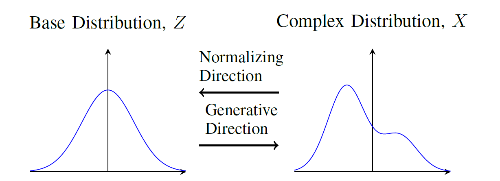

# Explainable Anomaly Detection in Network Traffic Using Normalizing Flows

[](https://opensource.org/licenses/MIT)
[](https://www.python.org/downloads/)

This is the official repository for the paper:

> **Explainable Anomaly Detection in Network Traffic Using Normalizing Flows**  
> Lior Shafir, Raja Giryes, Avishai Wool (Tel Aviv University)

In this repository you will find a python implementation of our anomaly detection method, as well as explainability and feature selection techniques using SHAP and LIME XAI methods.

## Overview

Normalizing Flows (NFs) provide an exact tractable likelihood function by transforming complex data distributions into a simple base distribution through a sequence of invertible mappings.
Our method leverages this property to model normal network traffic:
- The NF is trained solely on benign flows, learning a faithful estimate of their probability density.
- At test time, the log-likelihood of each flow under this model serves as an anomaly score.
  - High likelihood → normal traffic
  - Low likelihood → anomaly candidate

## Background and Motivation

Anomaly detection in network traffic is hard because anomalies are rare, diverse, and often absent from training data. Traditional supervised ML approaches struggle with this scarcity and class imbalance.

**Normalizing Flows** are a class of invertible generative models that provide **tractable density** estimation. By learning an exact log-likelihood function, they offer a principled way to model the probability distribution of normal traffic. 
The key idea is to represent a complex target distribution $p_X(x)$ as the result of applying a series of invertible transformations
to a simple base distribution $p_Z(z)$, such as the standard normal distribution.



<br/>

**Shapley Values**. Based on cooperative game theory, Shapely values provide a way to fairly distribute the “payout”
(in our context, feature importance) among the features of a model based on their contribution to the model’s predictions. The Shapley value for a feature is calculated as the average marginal contribution of that feature across all possible subsets of features.

In our method, we extend their use beyond explanability to provide **few-shots feature selection**:
- Use a small labeled anomaly set to highlight discriminative features.
- Identifying features with high variance in attribution across samples, without labels.


##  Requirements

- Python 3.8+
- See `requirements.txt` for detailed dependencies

Our method uses [PZflow](https://jfcrenshaw.github.io/pzflow/) python package to train a model of tabular data with normalizing flows.


##  Installation

1. Clone the repository:
```bash
git clone git@github.com:lshafir/NF-anomaly-detection.git
cd NF-anomaly-detection
```

2. Install dependencies:
```bash
pip install -r requirements.txt
```

## Datasets

The following datasets are used for evaluating the classification results of the proposed methods:

- [CIC-IDS2017](www.unb.ca/cic/datasets/ids-2017.html)
- [ISCXTor2016](https://www.unb.ca/cic/datasets/tor.html)
- [CIC-IoT2023](https://www.unb.ca/cic/datasets/iotdataset-2023.html)


These datasets should be downloaded separately and placed in the dataset folder.

## Basic Usage

This repository provides Python scripts to run the anomaly detection method and a visual demo using pairs of features:

### 1. NF Anomaly Detection (`nf_anomaly_detection.py`)

The primary script for training normalizing flows and evaluating anomaly detection performance.

#### Quick Start
```bash
# Run with default settings (PKL files, AUROC only)
python examples/nf_anomaly_detection.py

# Enable full evaluation (Precision, Recall, F1)
python examples/nf_anomaly_detection.py --evaluate-threshold

# Use CSV data with custom features
python examples/nf_anomaly_detection.py \
    --data-format csv \
    --benign-path dataset/sample/combined_data.csv \
    --feature-set IDS2017 \
    --feature-indexes 0 1 2 3 4 5
```

#### Key Parameters
- **Data**: `--data-format` (csv/pkl), `--benign-path`, `--attack-path`
- **Splitting**: `--train-size`, `--val-size`, `--test-size` (default: 5000/1000/5000)
- **Features**: `--feature-set` (IDS2017/TOR2016), `--feature-indexes`
- **Model**: `--learning-rate`, `--epochs`, `--optimizer` (sgd/adam)
- **Output**: `--verbose`, `--evaluate-threshold`

#### Default Configuration
- Data format: PKL files (`dataset/sample/BENIGN.pkl`, `dataset/sample/ATTACK.pkl`)
- Feature set: IDS2017 with 6 selected features
- Training: 5000 samples, 100 epochs, SGD optimizer
- Evaluation: AUROC only (use `--evaluate-threshold` for full metrics)

### 2. Feature Visualization (`example_2features_visualization.py`)

Visualize feature distributions and train normalizing flows on specific feature pairs.

```bash
python examples/example_2features_visualization.py
```

This script analyzes a set feature pairs. In the example you can find two pairs of features:
- **Discriminative**: Flow Duration vs Bwd Packet Length Max
- **Non-discriminative**: Total Fwd Packets vs Fwd Packet Length Min

Outputs include scatter plots, ROC curves, training loss, and AUROC scores saved to the `images/` folder.

##  Project Structure

```
NF-anomaly-detection/
├── examples/
│   ├── nf_anomaly_detection.py           # Main anomaly detection script
│   ├── example_2features_visualization.py # Feature visualization script
│   └── feature_reference.md              # Feature set reference
├── dataset/
│   └── sample/                           # Sample datasets
├── requirements.txt                      # Python dependencies
├── README.md                            # This file
└── LICENSE                              # MIT License
```


##  License

This project is licensed under the MIT License - see the [LICENSE](LICENSE) file for details.

##  Citation

If you use this code in your research, please cite our paper:

```bibtex
TBD
```


